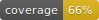

<h1 align="center">
 VarBench
</h1>

<p align="center">  <a href="https://github.com/VarBench-SE/VarBench">🏠 Home Page</a> • <a href="https://huggingface.co/datasets/CharlyR/varbench">🤗 Dataset</a>   </p>




## Evaluation

```md
### Running the Evaluation
The evaluation can be executed for any subset using the following script.

```sh
python3 -m varbench.run_evaluation [-h] --subsets SUBSETS [SUBSETS ...] --model MODEL [--run-model] [--api_url API_URL] [--api_key API_KEY] [--temperature TEMPERATURE] [--passk PASSK]
```

#### Arguments:
- `--subsets`, `-s`: Subset(s) to evaluate the model on. Defaults to `["tikz", "svg"]`.
- `--run-model`, `-r`: Launch the model locally for evaluation. If used with `--api_url`, `api_url` will be ignored.
- `--model`, `-m`: Name of the model to evaluate. Required.
- `--api_url`: URL of the compatible API. Defaults to `"https://api.openai.com/v1"`.
- `--api_key`: API key for authentication. Defaults to the environment variable `OPENAI_API_KEY`.
- `--temperature`: Sampling temperature for the model. Defaults to `0.7`.
- `--passk`: Number of responses generated per prompt to compute pass@k. Defaults to `1`.

#### Outputs:
- Results are saved in the `./results` directory. Subfolders are created based on the model name. Each subset generates:
  - A CSV file containing dataset-level results.
  - A JSON file summarizing evaluation scores.

### Examples

#### Using the API Model

- **With the OpenAI API**:
  ```sh
  python3 -m varbench.run_evaluation --subsets tikz svg --model gpt-3.5-turbo --api_key YOUR_API_KEY
  ```

- **With Another OpenAI-Compatible API**:
  ```sh
  python3 -m varbench.run_evaluation --subsets tikz --model llama-3.1-70b-versatile --api_url https://api.groq.com/openai/v1 --api_key $GROQ_API_KEY --temperature 0.7 --passk 5
  ```

#### Running Locally

- **Using a Locally Launched Model**:
  ```sh
  python3 -m varbench.run_evaluation --subsets tikz --model meta-llama/Llama-3.2-1B-Instruct --run-model --temperature 0.9 --passk 3
  ```

#### Notes:
1. Ensure the required environment variables (e.g., `OPENAI_API_KEY` or `HF_TOKEN`) are set if not explicitly passed as arguments.
2. For local models, ensure compatibility with the `vllm` framework.
3. The script creates directories dynamically for saving results, if they do not exist.

## Dataset

The dataset is created from the scripts situated in varbench/dataset_workflow

- Each folder in the dataset is a subset.
- Each subset contains a list of entries in the dataset in the form of a folder.
- These folders contain an input and a folder solutions.
- Each entry in the dataset has a instruction as well.


### Publishing the dataset
You can run the following command:

```sh
python3 -m varbench.dataset_workflow.create_dataset [-h] --dataset DATASET
```

The script will first compute the patches for each entry, then will add, commit, and push the changes to get a commit id and create the dataset with the instruction, the repo, the id of the commit, and the patch.

# Synthetic data generation
TODO: fix the script and Add documentation for the synthetic data generation

### Additional Notes
- **Environment Variables**: If `--api_key` is not provided, the script uses `OPENAI_API_KEY`.

